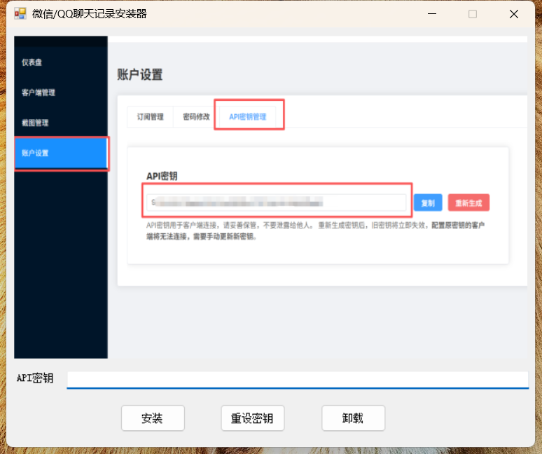
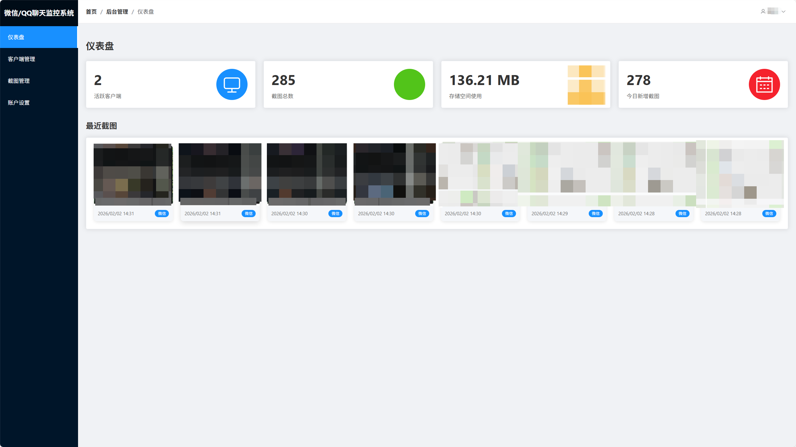
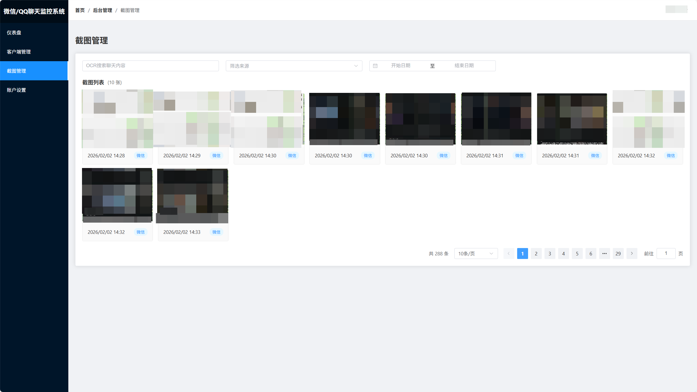
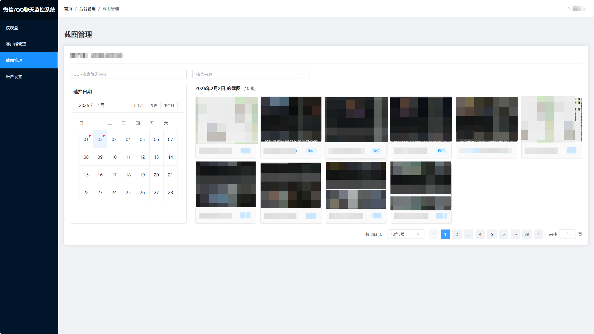
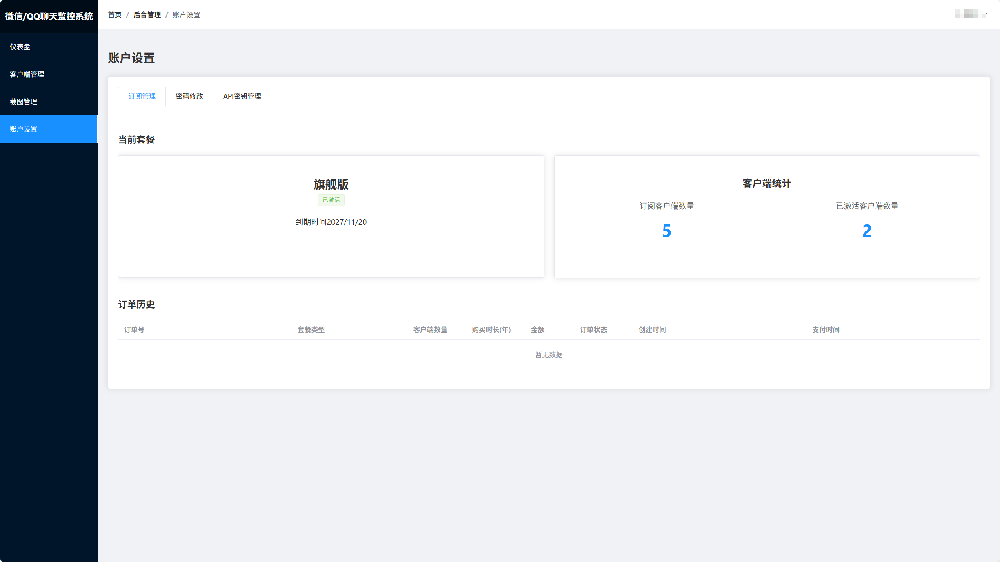

### 项目介绍

这是一个用于监控Windows电脑微信和QQ聊天窗口的应用程序，理论上也可以用于监控任何窗口，因为原理是截图

### 实现原理

周期性检测当前焦点窗口是否是微信或QQ，如果是，就截图及OCR并上传到云端。所以理论上改改可以监控任何窗口。缺点就是监控没那么精确，比如如果用微信的浏览器窗口拿来看视频，也会被监控上传。

### 项目结构

- MonitorInstaller

安装器

- MonitorService

Windows 服务程序

- ScreenshotHelper

截图及上传程序

### 直接使用

[ChatMonitor](https://www.chatmonitor.site/)

